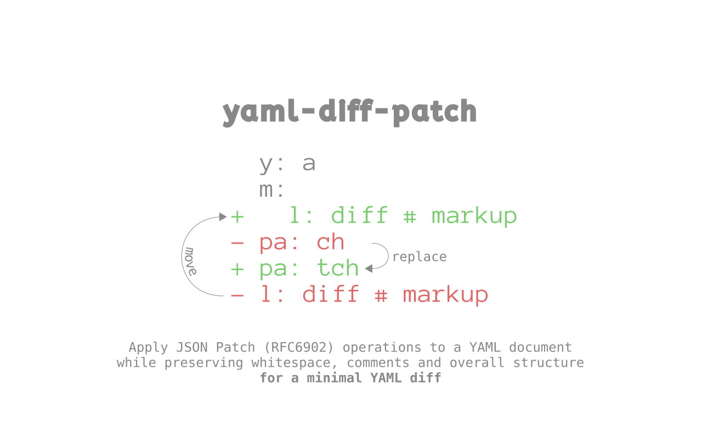

[![npm version][npm-image]][npm-url]
[![downloads][downloads-image]][npm-url]
[![build status][build-image]][build-url]
[![coverage status][coverage-image]][coverage-url]
[![Language grade: JavaScript][lgtm-image]][lgtm-url]
[![Node.JS version][node-version]][node-url]



YAML is a great format, similar to JSON. It allows comments and flexibility in objects and arrays with regards to the elements. They can be inlined (`[ ... ]` and `{ ... }`) or line-by-line.

YAML isn't however as easy to work with programmatically as JSON.

This package offers an API and standalone executables to allow for modifying a YAML as JSON, and then applying that JSON diff as a patch on the YAML, preserving whitespace, comments and overall structure. This also makes the final YAML diff minimal.


# Versions

 * Version 2.0 requires Node 14


# API

This package exports three functions: `yamlPatch`, `yamlDiffPatch` and `yamlOverwrite`.


## yamlPatch

```ts
function yamlPatch( yaml: string, rfc6902: Array< Operation > ): string;
```

This function applies `<rfc6902>` *"JSON Patch"* operations on a `<yaml>` while trying to preserve whitespace, comments and structure for a minimal change.

Returns the patched YAML.

You can use the [`rfc6902`][rfc6902-npm-url] package do create the patch object, or use `yamlDiffPatch` below.

> If the differences are too big, patching may fail (just like regular source code diff/patch operations). It's therefore recommended to - rather than re-using a JSON Patch for multiple different YAMLs - create the JSON Patch from each source YAML, transforming it as necessary and then apply that patch, whenever possible. That should never fail.


## yamlDiffPatch

```ts
function yamlDiffPatch( yaml: string, oldJson: any, newJson: any ): string;
```

Uses two JSON's (`<oldJson>` and `<newJson>`) and makes a diff between them, then applies this as a patch to the `<yaml>`.

Returns the patched YAML.

This is the same as `yamlPatch( yaml, makeJsonPatch( oldJson, newJson ) );` where `makeJsonPatch` would create an RFC6902 patch object.


## yamlOverwrite

```ts
function yamlOverwrite( yaml: string, newJson: any ): string;
```

Uses the source `<yaml>` as the source object and diffs that against `<newJson>`, then applies this diff as a patch to the `<yaml>`. This will overwrite the fields that are different, while maintaining the structure of the source YAML.

Returns the patched YAML.

This is the same as `yamlDiffPatch( yaml, yamlToJson( yaml ), newJson );` where `yamlToJson` would parse YAML into JSON.


# Executables

## yaml-patch

```
❯ yaml-patch

   Usage: yaml-patch source.yaml patch.json

   Patches <source.yaml> with the RFC6902 in <patch.json>

   Options:

   -h, --help           Print (this) help screen
   -o, --output <file>  Output filename to write to, or "-" for stdout (default: -)
```

## yaml-diff-patch

```
❯ yaml-diff-patch

   Usage: yaml-diff-patch source.yaml old.json new.json

   Patches <source.yaml> with the diff between <old.json> and <new.json>

   Options:

   -h, --help           Print (this) help screen
   -o, --output <file>  Output filename to write to, or "-" for stdout (default: -)
```

## yaml-overwrite

```
❯ yaml-overwrite

   Usage: yaml-overwrite source.yaml source.json

   Patches <source.yaml> with the diff between <source.yaml> and <source.json>

   Options:

   -h, --help           Print (this) help screen
   -o, --output <file>  Output filename to write to, or "-" for stdout (default: -)
```


[npm-image]: https://img.shields.io/npm/v/yaml-diff-patch.svg
[npm-url]: https://npmjs.org/package/yaml-diff-patch
[downloads-image]: https://img.shields.io/npm/dm/yaml-diff-patch.svg
[build-image]: https://img.shields.io/github/workflow/status/grantila/yaml-diff-patch/Master.svg
[build-url]: https://github.com/grantila/yaml-diff-patch/actions?query=workflow%3AMaster
[coverage-image]: https://coveralls.io/repos/github/grantila/yaml-diff-patch/badge.svg?branch=master
[coverage-url]: https://coveralls.io/github/grantila/yaml-diff-patch?branch=master
[lgtm-image]: https://img.shields.io/lgtm/grade/javascript/g/grantila/yaml-diff-patch.svg?logo=lgtm&logoWidth=18
[lgtm-url]: https://lgtm.com/projects/g/grantila/yaml-diff-patch/context:javascript
[node-version]: https://img.shields.io/node/v/yaml-diff-patch
[node-url]: https://nodejs.org/en/

[rfc6902-npm-url]: https://www.npmjs.com/package/rfc6902
